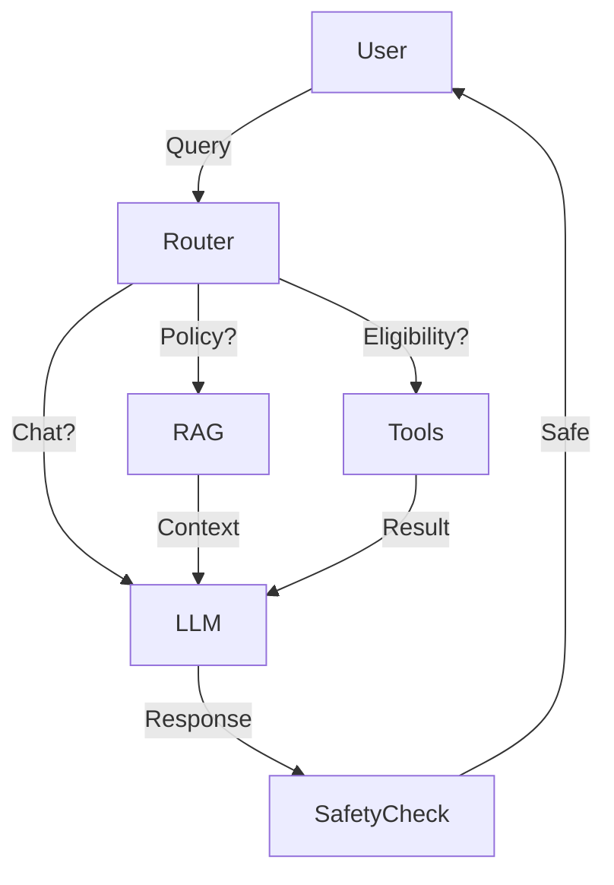

# Agent Architecture

## High-Level Data Flow

## detailed Components
1. **Orchestrator**: LangChain Agent.
2. **Memory**: ConversationBuffer (Session-based).
3. **Guardrails**: Input/Output filtering.
